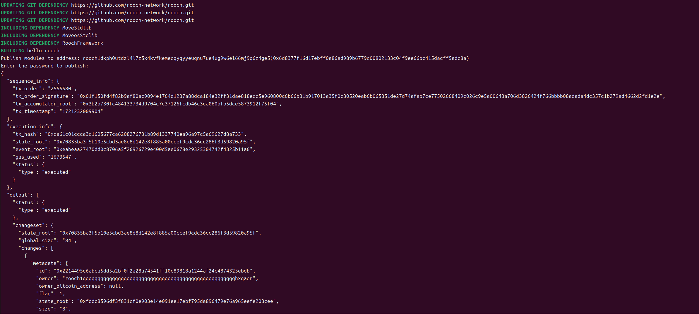

# 学习日志

## task01

本机是**Windows**环境的，但是考虑到后续win系统的开发不便，就先利用docker环境，进行节点同步

- docker里搜索：lncm/bitcoind
- pull之后在run
- 等待同步，查看height
- 

## tesk02

采用的是虚拟机中ubuntu环境

默认rooch安装完成

- 先进行创建账户，输入`rooch init`完成一些自定义设置好后

- 输入`rooch env list`,检查当前所在网络，我选择的是在测试网（testnet），`rooch env switch --alias test`该命令用于激活测试网，激活好后，在次输入`rooch env list`进行检查

- 领取gas，在`https://discord.gg/rooch`领取，你的地址可以用`rooch account list`查看

- `rooch account balance --address 地址`可查看gas

- 创建合约`rooch move new hello_rooch`

- 在sources目录下创建hello_rooch.move文件

  ~~~move
  module hello_rooch::hello_rooch {
      use moveos_std::account;
      use std::string;
  
      struct HelloMessage has key {
          text: string::String
      }
  
      entry fun say_hello(owner: &signer) {
          let hello = HelloMessage { text: string::utf8(b"Hello Rooch!") };
          account::move_resource_to(owner, hello);
      }
  }
  ~~~

- 编译：`rooch move build`
- 部署：`rooch move publish`

结果图：

