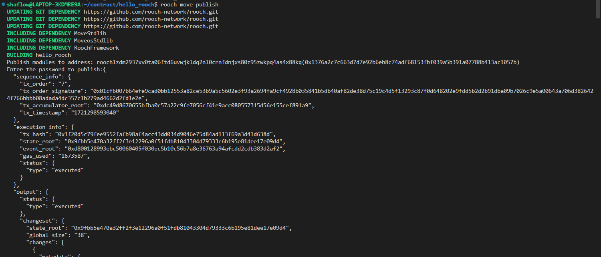

# 学习日志

## 第二课作业

### 一、从二进制安装rooch
1. 获取压缩包
```
wget https://github.com/rooch-network/rooch/releases/latest/download/rooch-ubuntu-latest.zip
```
2. 解压缩
```
unzip rooch-ubuntu-latest.zip
```
3. 环境
```
sudo cp rooch /usr/local/bin
```

### 二、创建账户并且领取测试币
1. 初始化创建默认账户
```
rooch init
```
2. 尝试手动创建新账户
```
rooch account create
```
3. 显示账户列表
```
rooch account list
```
### 三、创建并发布Move package
1. 新建hello_rooch包
```
rooch move new hello_rooch
```
2. 添加hello_rooch合约
```move
module hello_rooch::hello_rooch {
    use moveos_std::account;
    use std::string;
    struct HelloMessage has key {
        text: string::String
    }
    entry fun say_hello(owner: &signer) {
        let hello = HelloMessage { text: string::utf8(b"Hello Rooch!") };
        account::move_resource_to(owner, hello);
    }
}
```
3. 显示网络配置
```
rooch env list
```
4. 切换至开发者网
```
rooch env switch --alias dev
```

5. 发布hello_rooch包
```
rooch move publish
```

