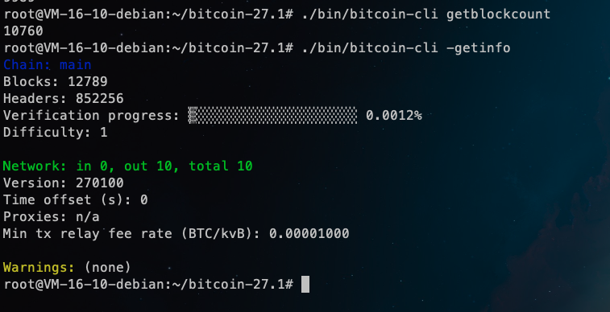
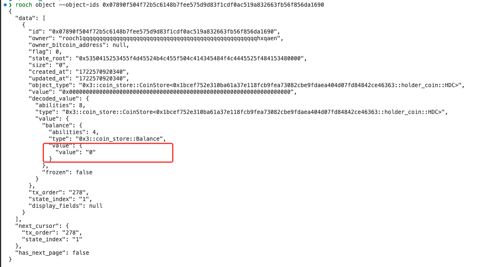

# 学习日志

## task1 搭建比特币节点

1. 下载程序

下载地址： [https://bitcoincore.org/en/download/](https://bitcoincore.org/en/download/)
根据你的操作系统选择对应的程序。

2. 运行 bitcoind 启动节点

下载解压，目录结构如下：


3. 启动节点

```shell
./bin/bitcoind
```

节点同步状态如下:

先经历一个比较漫长的 `Pre-synchronizing` 阶段


再经历一个比较漫长的 `Synchronizing blockheaders` 阶段


最后，开始同步区块


4. 查看节点信息

```shell
./bin/bitcoin-cli -getinfo
```


获取同步的区块高度

```shell
./bin/bitcoin-cli -getblockcount
```



5. 方便 rpc 请求，配置文件 `bitcoin.conf` 添加 rpc 授权信息

```conf
rpcuser=admin
rpcpassword=admin
```

启动的时候，使用全路径指定配置文件:

```shell
./bin/bitcoind -conf=/root/bitcoin-27.1/bitcoin.conf
```

curl 使用 rpc 调用，获取节点信息:

```shell
 curl -u admin:admin --data-binary '{"jsonrpc": "1.0", "id":"curltest", "method": "getblockchaininfo", "params": [] }'  http://127.0.0.1:8332/ | jq
```


## task2 部署一个和 bitcoin 交互的 move 合约

### 合约简单说明

合约实验通过修改基本的 `Counter` 合约来实现。
合约部署完成后，会在当前模块的地址创建一个 `Counter` 的实例。
`Counter` 实例中包含了， 创建模块的时候比特币公链的块高。

后续 increment 方法可以对 Counter 实例中的值进行加一操作。这里会判断下调用合约模块时候的比特币块高。
块高必须满足一定的条件,才会执行。以此借助 btc 的 pow 能力，控制 合约的执行。

### 实现步骤

1. 准备基本环境

a. 创建 rooch 的基本账号,领取一定的 gas token 。

使用 rooch 命令行工具，创建一个账号。

```shell
rooch init
```

注意，保存好，你的助记词和私钥，一定不要泄露。
gas token 需要从 `Discord`中获取。

使用 `rooch account balance` 确认 gas token .


b. 修改配置文件，确认网络状态。

配置文件目录: ~/.rooch/rooch_config/rooch.yaml

内容如下:

```yaml
keystore_path: /Users/yourname/.rooch/rooch_config/rooch.keystore
active_address: 0xaef440f63dbbad67c3ce25dfc863e18dc603565e57f009eaa846d31356299558
envs:
  - alias: local
    rpc: http://0.0.0.0:50051
    ws: null
  - alias: dev
    rpc: https://dev-seed.rooch.network:443/
    ws: null
  - alias: test
    rpc: https://test-seed.rooch.network:443/
    ws: null
active_env: test
```

其中 `active_address` 配置默认账户，可以根据自己的账户地址进行修改。
`active_env` 配置网络环境，这里使用的是 test 网络。

2. 编写合约

创建项目:

```shell
rooch move new btc-locker
```

修改 Move.toml 配置

```toml
[package]
name = "btc-locker"
version = "0.0.1"

[dependencies]
MoveStdlib = { local = "../../rooch/frameworks/move-stdlib" }
MoveosStdlib = { local = "../../rooch/frameworks/moveos-stdlib" }
RoochFramework = { local = "../../rooch/frameworks/rooch-framework" }
BitcoinMove = { local = "../../rooch/frameworks/bitcoin-move" }

[addresses]
btc_locker = "0xaef440f63dbbad67c3ce25dfc863e18dc603565e57f009eaa846d31356299558"
std = "0x1"
moveos_std = "0x2"
rooch_framework = "0x3"
bitcoin_move =  "0x4"

```

其中 dependencies 模块默认使用 github 远程配置，可以使用本地的 local 配置，加速合约的编译。
合约中会使用 bitcoin 的相关功能，所以加入 BitcoinMove 和 bitcoin_move 两个定义。

3. 编译合约

Move 合约代码如下：

```move
// Copyright (c) RoochNetwork
// SPDX-License-Identifier: Apache-2.0

module btc_locker::counter {
    use moveos_std::account;
    use bitcoin_move::bitcoin;
    use bitcoin_move::types::{BlockHeightHash,unpack_block_height_hash};
    use std::option::{Self};

    const ErrorBitcoinClientError: u64 = 10;
    const ErrorBitcoinBlockError: u64 = 11;

    struct Counter has key {
        count_value: u64,
        last_block: u64
    }

    fun init() {
        let signer = moveos_std::signer::module_signer<Counter>();
        account::move_resource_to(&signer, Counter { count_value: 0,last_block:0 });
    }

    entry fun increase() {
        let latest_block = bitcoin::get_latest_block();
        assert!(option::is_some<BlockHeightHash>(&latest_block), ErrorBitcoinClientError);
        let (height,_hash) = unpack_block_height_hash(option::destroy_some(latest_block));
        let counter = account::borrow_mut_resource<Counter>(@btc_locker);
        assert!(height % 10 >= 2, ErrorBitcoinBlockError);
        counter.count_value = counter.count_value + height % 10;
        counter.last_block = height;
    }
}
```

其中 Counter 对象，分配到发布的地址上，供所有使用者共享。其中 increse 操作的时候，会判断 当前比特币的块高，个位数一定要 大于等于 2 ，才会往下执行。

** rooch 上的 btc 高度相比于 btc 本身的高度，延后了 3 个区块。 **

4. 合约编译、发布

```shell
rooch move build
rooch move publish --max-gas-amount 50000000
```

如果发布失败，适度的调整 最大 gas 消耗。

发布成功后，就可以通过 cli 来调用合约获取 Counter 对象。

```shell
rooch resource --address 0xaef440f63dbbad67c3ce25dfc863e18dc603565e57f009eaa846d31356299558 --resource 0xaef440f63dbbad67c3ce25dfc863e18dc603565e57f009eaa846d31356299558::counter::Counter
```


cli 调用 increment 方法

```shell
rooch move run --function 0xaef440f63dbbad67c3ce25dfc863e18dc603565e57f009eaa846d31356299558::counter::increase --max-gas-amount 50000000 | jq ".execution_info"
```

status 可以表示交易是否生效。


## task3 部署本地的 rooch bitcoin 开发环境，并部署合约

### 1. 节点配置

节点基本环境参考 task1 中的部分，为方便测试，将 启动 bitcoin regtest 节点和 rooch 节点封装成了如下的脚本:

```shell
kill $(cat data/regtest/bitcoind.pid)
rm -rf data/regtest
sleep 3
./bin/bitcoind -conf=`pwd`/bitcoin.conf
rooch server clean --force
rooch server start --btc-rpc-url http://127.0.0.1:18443 --btc-rpc-username bitcoin --btc-rpc-password 123456 --btc-sync-block-interval 1
```

脚本每次启动，都会删除旧的区块数据 ， 同时 rooch 的区块同步，一个区块同步一次。

bitcoin.conf 中配置内容如下：

```toml
daemon=1
datadir=/Users/rooch/outcode/git/rooch_learn/bitcoin/bitcoin-27.1/data
txindex=1
```

配置好区块目录和 daemon 模式，开启 txindex 功能。

自己启动的 regtest 节点没有旷工，所以，需要自己完成区块确认和挖矿。

自定义一个 mine.sh

```shell
#!/bin/bash

for i in {1..86400}; do
   bitcoin-cli generatetoaddress 1 bcrt1p6yeymhcd4megq8dfjtlpdd6lv04p58rru2pw5ljaf6hs4ms0enyskyp5l4
   rooch object -t 0x4::bitcoin::BitcoinBlockStore | jq ".data[0].decoded_value.value.latest_block"
   sleep 1
done

```

脚本往固定地址挖矿，并获得出块奖励。同时显示 rooch 中已经完成区块同步的高度。


**Coinbase 产生的 UTXO 需要块高达到 100 才可以完成交易。**

### 2. 部署合约

合约采用 `holder_coin` 中的 `HDC` 作为基础合约。再此基础上添加 special_claim 方法。
当符合一定条件的 UTXO 可以无需质押，就可以完成 Token 的 Claim 操作。

核心代码是对 UTXO 相关交易的解析，代码实现如下：

```move
struct UTXOEvent has drop,copy {
    msg: vector<u8>,
    msgString: string::String,
}

fun utxo_special(utxo: &UTXO) : bool {
    let utxo_tx =  option::destroy_some(bitcoin::get_tx(utxo::txid(utxo)));
    let outputs = tx_output(&utxo_tx);
    let l = vector::length(outputs);
    let find_op_return = false;
    while (l >0){
        let x = vector::borrow(outputs, l-1);
        let s = txout_script_pubkey(x);
        if(is_op_return(s)){
            let msg = witness_program(s);
            event::emit(UTXOEvent{
                msg: msg,
                msgString: string::utf8(hex::encode(msg)) ,
            });
            if(msg == b"rooch"){
                find_op_return = true;
                break
            }
        };
        l = l-1;
    };
    find_op_return
}
```

1. UTXO 对象解析

合约调用时候传递 `&mut Object<CoinInfoHolder>` 对象，可以通过 `let myutxo = object::borrow(utxo_obj); `获得 UTXO 对象。

2. 获取交易对象

使用 utxo::txid 获取交易 ID,bitcoin::get_tx 获取交易对象

3. 循环遍历 output 判断是否是 OP_RETURN 类型

使用 tx_output(&utxo_tx); 获得交易的输出内容。
遍历输出内容，通过 txout_script_pubkey 获得脚本内容。
如果 is_op_return 为 true 则表示 OP_RETURN 脚本。

4. 获取 OP_RETURN 脚本内容

let msg = witness_program(s); 可以获取脚本内容
string::utf8(hex::encode(msg)) 可以解析为字符串。

主要的判断逻辑为： UTXO 所在的 output 中，必须包含一个 OP_RETURN 脚本，并且脚本内容为 `rooch` 字符串。

部署脚本内容:

```shell
rooch move build
rooch move publish --max-gas-amount 50000000
```

**rooch 本地网络不需要 gas 费，直接部署即可**


部署完成后获取 Hodler 对象.


### 3. 部署测试

生成 UTXO 到一个客户端地址 A,要由这个地址发送带有 OP_RETURN 的 UTXO 到 rooch 的地址 B。

```shell
bitcoin-cli generatetoaddress 1 bcrt1pjm76nh0td4h92ytnccgt680clttrqpqjnw9lnruxw4x96d5pf25qcvwgxa
```

等待大约 100 个区块，发起一个交易内容。

大约得交易内容如下：

```rust
let utxo_tx = "3fd12d6f5193ae5b6ec7576a85847cf9bb9d3814f1efd8f935243b4abd6cc86c";
let utxo_idx = 0;
let spend_account =
Address::from_str("bcrt1pmg7tqrf92p5wt6x9t4ykxa4a098mhw7c6209qanahhpx9wxx5xsqyk5sk6")
    .unwrap()
    .assume_checked();

let utxo_tx = rpc.get_raw_transaction(&Txid::from_str(&utxo_tx)?, None)?;
let utxos = transaction_to_utxos(&utxo_tx);

let mut unsigned_tx = {
for (utxo, tx_out) in &utxos {
    info!("utxo : {:?}", utxo);
    info!("tx_out : {:?}", tx_out);
}

let send_gas = Amount::from_sat(10000);
let input_value = utxos[utxo_idx].1.value;
let spend_amount = Amount::ONE_BTC / 10000;
let change_amount = input_value - spend_amount - send_gas;

let input = TxIn {
    previous_output: utxos[utxo_idx].0,
    script_sig: ScriptBuf::default(),
    sequence: Sequence::ENABLE_RBF_NO_LOCKTIME,
    witness: Witness::default(),
};

let data = b"rooch";
let op_return_script = Builder::new()
    .push_opcode(bitcoin::blockdata::opcodes::all::OP_RETURN)
    .push_slice(data)
    .into_script();
let op_return_txout = TxOut {
    value: Amount::ZERO,
    script_pubkey: op_return_script,
};

let spend_out: TxOut = TxOut {
    value: spend_amount,
    script_pubkey: spend_account.script_pubkey(),
};

let change_out = TxOut {
    value: change_amount,
    script_pubkey: current_address.script_pubkey(),
};

Transaction {
    version: Version::TWO,
    lock_time: LockTime::ZERO,
    input: vec![input],
    output: vec![spend_out, change_out, op_return_txout],
}
};
```

由于 mine.sh 的同步很快，所以，可以认为 rooch 是一个很好用的 address inderx.

```shell
rooch rpc request --method btc_queryUTXOs --params '[{"owner":"bcrt1pjm76nh0td4h92ytnccgt680clttrqpqjnw9lnruxw4x96d5pf25qcvwgxa"}, null, "30", true]'
```

获得符合条件的 UTXO ，就可以调用 special_claim 方法了。

```shell
rooch move run --function default::holder_coin::claim_special --args object_id:$holder_id --args object_id:$utxo_id | jq ".execution_info"
```

## task4 部署一个 nft 合约 , mint 的时候消耗 task3 中的 HDC coin

代码文件分两个:

- collection.move 集合文件，一个 nft 会属于一个集合，创建 nft 之前先创建对应的集合
- btc_nft.move nft 合约文件，其中包含 nft 的相关操作，mint 部分做了一些修改。

### 修改 1 init 的时候，注册 Global 的 Resource,并将其转移到 当前模块下:

```move

// struct 信息
struct Global has key, store {
        coin_store: object::Object<coin_store::CoinStore<HDC>>
}

....
注册部分
let coin_store = coin_store::create_coin_store<HDC>();
let signer = moveos_std::signer::module_signer<NFT>();
account::move_resource_to(&signer, Global{
    coin_store,
});
...

```

### 修改 2 mint 的时候，将 coin 转移到当前模块下

```move
let  mint_gas = 1000;
let g = account::borrow_mut_resource<Global>(@btc_locker);
let user_coin = account_coin_store::withdraw<HDC>(s,mint_gas);
coin_store::deposit<HDC>(&mut g.coin_store, user_coin);
```

同时需要注意的是: 使用到了 signer ， 所以，需要定义 entry 的时候添加上 signer 参数。

### 代码部署

代码部署需要分两步，因为 nft 在 init 的时候 ， 对应 Coin 信息需要已经注册。所以，先要把 task3 中的 coin 部署完成。


部署完成后，从当前模块的 Resource 中会取到 Global 的信息。 其中 coin_store 是一个对象，拿到这个对象 id,就可以通过各种方法监控状态。

```shell
rooch object --object-ids 0x07890f504f72b5c6148b7fee575d9d83f1cdf0ac519a832663fb56f856da1690
```



### 创建 collection

```shell
rooch move run --function default::collection::create_collection_entry --args String:'hello nft collection' --args String:'https://github.com/xxxx' --args address:0x1bcef752e310ba61a37e118fcb9fea73082cbe9fdaea404d07fd84842ce46363 --args String:'description' --args u64:123456
```

创建完成后，观察输出，可以看到 collection_id:

```json
"metadata": {
    "id": "0x27931f31a1c5821c9435d79695ebf6de1850795d25faf6b3212da88478ccc5a8",
    "owner": "rooch1qqqqqqqqqqqqqqqqqqqqqqqqqqqqqqqqqqqqqqqqqqqqqqqqqqqqhxqaen",
    "owner_bitcoin_address": null,
    "flag": 1,
    "state_root": "0x5350415253455f4d45524b4c455f504c414345484f4c4445525f484153480000",
    "size": "0",
    "created_at": "1722523616520",
    "updated_at": "1722523616520",
    "object_type": "0x1bcef752e310ba61a37e118fcb9fea73082cbe9fdaea404d07fd84842ce46363::collection::Collection"
},
```

### mint nft

mint 之前需要保证你的 account 有足够的 HDC Token,如果没有，请参考 task3 mint 一些。

```shell
rooch move run --function default::btc_nft::mint_entry --args object_id:$collection_id --args String:'my nft name'
```

### 查看我的 nft

```shell
rooch object --owner rooch1r080w5hrzzaxrgm7zx8uh8l2wvyze05lmt4yqng8lkzggt8yvd3sec4m2m
```


### 确认下 resource 下的 balance 变化


